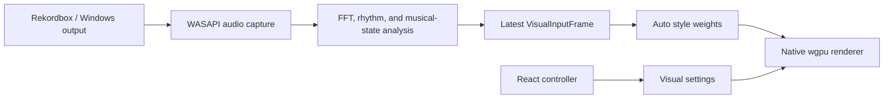
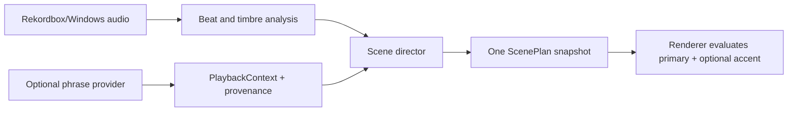

# Codex implementation brief: reliable Rekordbox startup and phrase-directed visuals

## Mission

Implement the next PulseBridge release. Do not stop after analyzing or writing a plan: diagnose, code, test, document, and leave the repository in a runnable state.

The user reported all of the following:

- Pressing **Start live visuals** appeared to crash the application; PulseBridge was no longer visible in Task Manager.
- Rekordbox did not connect reliably.
- The app should use Rekordbox's analyzed song phrases to direct large visual changes instead of treating every waveform layer as an independent visual trigger.
- **Auto** mode (the user's “all lights” mode) is too chaotic because too many effects appear simultaneously.
- Auto mode lacks flow, clarity, and coordination between effects.
- A visible line runs from the left edge toward/through the center of the performance image.
- The visual library needs more distinctive, polished designs.
- The show is too repetitive and needs controlled variation.

Assume “all lights” means the current `Auto` visual style unless testing proves otherwise.

## Definition of success

On the target Windows DJ laptop:

1. Starting visuals never terminates the PulseBridge control application.
2. The performance window starts successfully or the control window shows a specific, useful error and remains usable.
3. Rekordbox audio capture connects when supported, falls back predictably when necessary, and exposes its true state in the controller.
4. Phrase information drives the show's large-scale scene choices when a supportable phrase source is available. Live audio continues to drive beat-level motion and accents.
5. If genuine Rekordbox phrase data cannot be accessed through a supportable read-only method, the app clearly labels and uses an audio-inferred phrase fallback. Never claim that inferred data came from Rekordbox.
6. Auto mode normally has one dominant visual family and at most one restrained accent/crossfade layer. It should feel directed, not like every effect is on.
7. The left-edge/center line is gone at every tested aspect ratio and in every visual family.
8. Visual changes feel intentional across intros, verses, builds, choruses/drops, breakdowns, bridges, and outros, with less repetition.

## Repository ground truth

Read the existing documentation before editing:

- `README.md`
- `docs/architecture.md`
- `docs/audio-analysis.md`
- `docs/visual-language.md`
- `docs/reliability.md`
- `docs/development.md`
- `WINDOWS_TRANSFER.md`

Current architecture:



Important facts from the current implementation:

- This is a Tauri 2 application with a React controller and a native Rust/`wgpu` performance renderer.
- `src-tauri/src/audio/wasapi.rs` detects `rekordbox.exe` and captures its process tree through Windows process-loopback. If that fails, it attempts default-output loopback.
- The current “Rekordbox connection” is audio-only. There is no current track, deck, playhead, beat-grid, or phrase-metadata connection.
- `PerformanceManager::start` in `src-tauri/src/display/mod.rs` returns success immediately after spawning the renderer thread. It does not wait for GPU/surface/pipeline initialization or the first rendered frame.
- A fatal renderer error sets the shared stop flag, but the session can remain stored. Worker panics are not converted into user-visible diagnostics.
- The release is configured with `windows_subsystem = "windows"`, so console-only errors are not an adequate diagnostic path.
- `src-tauri/src/visuals/state.rs` represents Auto as five nonzero style weights in many musical states.
- `src-tauri/shaders/performance.wgsl` evaluates all five visual functions and adds their full-screen results. Even low-weight layers contain baseline light, so the composition can become muddy and busy.
- `palette_field` uses `fract` but does not blend the last palette color back to the first. Effects using `atan2` therefore have a likely discontinuity along the negative X axis—the reported line from the left edge toward the center.
- The browser GLSL preview in `app/src/visuals/shader.ts` mirrors the same visual math and must receive equivalent seam/design fixes, but it must remain an ambient appearance preview with no fake live audio.
- The current local baseline is green: 14 Rust tests pass, and frontend typecheck, lint, and production build pass.

## Non-negotiable constraints

- Diagnose before declaring a root cause. The observations above are strong suspects, not proof from the user's Windows machine.
- Preserve the separation between capture, analysis, direction, rendering, and React control.
- Keep audio buffers and histories bounded. Do not write raw audio to disk.
- Keep the performance display free of text, UI, waveforms, logos, errors, and debug overlays.
- Keep white flash opt-in and bounded. Do not increase strobing to make new visuals feel more energetic.
- Do not scrape Rekordbox pixels, inject into its process, hook private memory, bypass encryption, alter its database, or depend on a paid/cloud LLM service.
- Treat Rekordbox libraries and analysis files as read-only. Fail closed if a file format/version is unknown.
- Do not call audio-inferred state “Rekordbox phrase data.” Expose provenance in diagnostics/UI.
- Do not make the performance renderer wait on Rekordbox metadata, disk I/O, React, or network calls.
- Do not add an unbounded event queue. Consumers should receive a current immutable snapshot/timeline plus a small bounded history where necessary.
- Preserve manual visual styles and fixed palettes.
- No unrelated redesign of the controller.
- Avoid a large dependency if a small, well-tested implementation is sufficient.

## Required execution order

### Phase 0 — Capture evidence and make startup failure observable

Do this before changing visual behavior.

1. Add structured native logging for application startup, settings load, display selection, performance-window creation, renderer initialization steps, chosen GPU adapter/backend, audio source selection, process-loopback activation, format negotiation, fallback activation, worker exit, stop, and cleanup.
2. Write bounded/rotated logs to the platform app-data/config location so an installed GUI build retains useful errors without a console. Never log audio samples or private library contents.
3. Show the log-file location and a concise copyable error in the control window when startup fails. Keep detailed diagnostics off the performance display.
4. Add explicit lifecycle state to the runtime snapshot: at minimum `stopped`, `starting`, `running`, `recovering`, and `failed`. Do not infer the entire lifecycle solely from `session.is_some()` and a stop flag.
5. Include renderer and phrase-source status separately from audio capture status. “Rekordbox detected” must not imply that audio samples or phrase metadata are flowing.

Deliverable: a Windows run now produces enough evidence to distinguish a Tauri window failure, GPU initialization failure, shader/pipeline failure, WASAPI failure, unexpected worker exit, and process panic.

### Phase 1 — Fix startup, cleanup, and Rekordbox audio reliability

#### Renderer/session lifecycle

1. Introduce a startup readiness handshake from the renderer worker to `PerformanceManager::start`.
2. Do not return success until the renderer has initialized its surface/adapter/device/pipeline and produced a first valid frame, or until a bounded timeout/error occurs.
3. Keep the performance window hidden until the renderer is ready, then show/focus/fullscreen it. Avoid exposing an empty desktop or white frame.
4. Make startup transactional. If any step fails, signal all workers, join what was started, restore cursor/window state, close the performance window, clear the session, retain the error, and leave the control app alive.
5. Convert renderer/analysis/audio worker panics into a failed runtime state and log entry. A worker failure must not take down the application.
6. When the renderer dies unexpectedly, automatically clean up the session instead of leaving a stale `PerformanceSession` that blocks or confuses the next start.
7. Make Start/Stop idempotent under rapid clicks and repeated use. Never hold the session mutex while blocking on joins or long initialization.
8. Try compatible GPU adapter choices deliberately and report which was selected. If appropriate for `wgpu` 30 on Windows, attempt a software/fallback adapter after normal hardware choices fail. Do not silently hide the reason for a fallback.

#### WASAPI/process capture

1. Verify the current process-loopback implementation on the actual Windows and Rekordbox versions. Record OS build, Rekordbox executable/PID choice, activation HRESULT, and selected fallback without logging sensitive paths.
2. Do not assume the first matching `rekordbox.exe` PID is necessarily the correct audio-owning process. Enumerate candidates/process relationships and use a deterministic selection/attempt strategy.
3. Negotiate or validate the actual shared-mode audio format instead of assuming that every source accepts hard-coded 48 kHz stereo IEEE float. Correctly handle the formats the selected process/endpoint can provide, convert/downmix safely, and reject unsupported formats with a useful error.
4. Keep process-only capture as the preferred path. Preserve selected-output and default-output fallback, but make the active path unmistakable in runtime status.
5. If Rekordbox uses ASIO and bypasses Windows output, retain the documented PC MASTER OUT guidance. Do not present silence as a successful reactive connection.
6. Detect “client initialized but no samples” separately from “samples flowing.” Use a bounded grace period and then enter a useful recovering/silent state.
7. Test Rekordbox exit/restart, output-device changes, and fallback recovery without restarting PulseBridge.

Add focused unit tests for state transitions, transactional rollback, stale-session cleanup, format conversion/downmix logic, and reconnect policy. Keep Windows API calls behind a testable boundary so most lifecycle logic is testable without live hardware.

### Phase 2 — Add a phrase-source boundary without pretending an API exists

Rekordbox definitely performs Phrase Analysis, but its public developer page currently documents playlist XML import rather than a public live phrase/playhead API. Official documentation confirms phrase categories such as Intro, Up, Down, Chorus, Bridge, Verse, and Outro, plus short Fill sections. Treat access to those results as a feasibility question, not an assumed API.

Author `docs/rekordbox-phrase-integration.md` while implementing this phase. Record:

- Target Rekordbox version(s) and Windows version tested.
- Every official interface investigated.
- Whether it exposes phrase boundaries, phrase kinds, the current loaded track, active/master deck, live playhead, beat grid, and track changes.
- Data freshness, permissions, failure modes, and format/version stability.
- The selected implementation and why it is supportable.
- The fallback when any required piece is unavailable.

Start with these official references:

- [rekordbox for Developers](https://rekordbox.com/en/support/developer/)
- [rekordbox Phrase Edit operation guide](https://cdn.rekordbox.com/files/20200312172204/rekordbox5.1.0_Phrase_Edit_operation_guide_EN.pdf)
- [rekordbox Lighting operation guide](https://cdn.rekordbox.com/files/20210602085902/rekordbox6.5.2_lighting_operation_guide_EN.pdf)
- [current rekordbox manual](https://rekordbox.com/en/support/manual.php)

Create an internal boundary resembling the following; use idiomatic Rust names rather than copying this literally if a better design fits:

```rust
enum PhraseKind {
    Intro,
    Verse,
    Up,
    Chorus,
    Down,
    Bridge,
    Outro,
    Fill,
    Unknown,
}

enum PhraseProvenance {
    Rekordbox,
    CueMarkers,
    AudioInferred,
    Unavailable,
}

struct PhraseSegment {
    kind: PhraseKind,
    start_ms: u64,
    end_ms: Option<u64>,
    confidence: f32,
}

struct PlaybackContext {
    stable_track_id: Option<String>,
    position_ms: Option<u64>,
    playing: bool,
    active_deck: Option<u8>,
    phrase: Option<PhraseSegment>,
    phrase_progress: Option<f32>,
    provenance: PhraseProvenance,
    updated_at: Instant,
}
```

Requirements:

1. Make phrase metadata an optional provider, not a prerequisite for audio capture or rendering.
2. Keep live playback position synchronized independently of the audio FFT. Reject stale metadata and degrade smoothly.
3. Prefer a documented, live, read-only Rekordbox interface if one exists and is verified on the target machine.
4. If only stable read-only phrase analysis files are supportable, parse a versioned subset defensively and still solve current-track/playhead matching. Never guess a match from title text alone.
5. Hot/memory cues may be used as a lower-fidelity structural source when explicitly identifiable, but label their provenance accurately.
6. If no safe route provides both phrase boundaries and live position, implement a bounded `AudioInferredPhraseProvider` based on longer-horizon novelty, energy trend, beat/bar continuity, and the existing musical states. This is the required functional fallback.
7. A phrase-provider failure must never stop the audio capture or renderer. Hold the last fresh structural state briefly, then fade into audio-inferred direction.
8. Add fixture-driven provider tests using synthetic metadata—not copyrighted tracks or bundled audio.

Desired data flow after this phase:



### Phase 3 — Replace additive Auto mode with a real scene director

Do not merely lower all five existing weights. Replace the behavior that creates chaos.

Add a native `SceneDirector` between musical/phrase state and renderer parameters. It should output a compact `ScenePlan` containing at least:

- Dominant visual family.
- Optional secondary family used only for a transition or compatible accent.
- Primary/secondary mix, with normalized energy rather than unbounded additive light.
- Variation seed and a small set of family-specific parameters.
- Palette target.
- Motion, detail, density, brightness, and accent budgets.
- Transition start/duration/easing.
- Reason/source for diagnostics only (phrase, inferred state, manual override, or fallback).

Direction rules:

1. Phrase type controls macro structure. Beats/onsets/bass/highs control motion inside the chosen scene; they should not independently summon several full-screen visual families.
2. A stable phrase should retain a coherent visual identity. Major switches should normally happen at a phrase boundary or a high-confidence impact, not multiple times per second.
3. Normal maximum is one dominant family plus one subtle compatible accent. During a primary-family crossfade, disable unrelated accents so only the outgoing and incoming families are evaluated.
4. Chill should usually use one family. Balanced may use one family plus a restrained accent. Wild may be more energetic but must still obey the two-family and luminance budgets.
5. Use a compatibility matrix. Examples: sparse beams can accent Fluid/Aurora; a short Burst can accent a Chorus impact; Tunnel and dense Kaleidoscope should not run together at full strength.
6. Apply minimum dwell time, hysteresis, phrase-boundary alignment, and transition easing. Avoid rapid style or palette oscillation.
7. Use deterministic variation seeded by a stable track ID plus phrase index when available. For audio-inferred operation, use a stable session seed plus bounded phrase counter. Never use frame-by-frame randomness.
8. Track a small bounded recent-scene history. Avoid the same primary family for more than two consecutive phrases when compatible alternatives exist, and avoid repeating the same complete scene plan within a short window.
9. Manual visual styles bypass automatic family selection but retain safe brightness, seam fixes, phrase-aware parameter modulation where useful, and smooth transitions.
10. On stale/missing phrase data, continue the current scene and then transition gracefully to audio-inferred direction. Never snap to a busy default.

Use a mapping as a starting point, not a rigid loop:

| Phrase | General direction | Energy behavior |
| --- | --- | --- |
| Intro | Fluid, Aurora, sparse Starfield | Slow reveal and low density |
| Verse | Waves, Ribbon Flow, restrained geometry | Consistent groove and breathing room |
| Up/build | Tunnel, converging beams, rising lattice | Increasing tension without adding every layer |
| Chorus/drop | Pulse, Kaleidoscope, controlled impact Burst | Strong scale and color release |
| Down/breakdown | Fluid, Aurora, sparse particles | Lower brightness, longer motion, negative space |
| Bridge | Prism/ribbon variation distinct from verse | Transitional color and direction change |
| Outro | Fluid/Starfield dissolution | Gradual simplification |
| Fill | One short compatible accent | No full-scene reset for a few beats |

Add tests proving:

- At most two render families are active.
- Mix values remain normalized and finite.
- Dwell/cooldown rules are enforced.
- Identical inputs and seed produce deterministic plans.
- Phrase changes produce smooth transitions.
- Stale phrase metadata degrades to inferred mode.
- Manual styles remain stable.
- Recent-scene history stays bounded.

### Phase 4 — Remove the seam and expand the visual library cleanly

#### Seam fix

1. Make palette lookup genuinely cyclic: interpolate `A → B → C → D → A`, including a continuous `D → A` interval at the wrap.
2. Audit every `atan2`/angle-derived coordinate in WGSL and browser GLSL. Values immediately on either side of the `-π/π` boundary must produce equivalent colors and geometry.
3. Fix the mathematical discontinuity; do not hide it with a blur, crop, vignette, or by rotating the seam off-screen.
4. Add a small CPU-side periodicity/seam regression test for shared palette/angle math where feasible, plus visual screenshot checks at 16:9, 16:10, 4:3, ultrawide, 1080p, and 4K.

#### New visual families

Add at least four visually distinct, GPU-efficient families. Recommended set:

- **Aurora** — soft flowing curtains with large areas of calm color.
- **Prism Beams** — a small capped number of clean volumetric-looking rays with controlled bloom.
- **Kaleidoscope** — mirrored geometric petals with an explicit low-density mode.
- **Star Trails** — sparse procedural points/trails with bounded count and no noisy full-screen sparkle.
- Optional fifth: **Ribbon Flow** or **Horizon Grid**, if it remains visually distinct and inexpensive.

Quality rules:

1. Each family must have a recognizable silhouette and a calm state; “new” cannot mean another recolored version of the same sine field.
2. Preserve negative space. Accent layers should output masks/light accents rather than an always-lit full-screen baseline.
3. Stop evaluating every visual function every pixel. Pass primary/secondary family IDs and blend parameters, then branch so the shader computes only the required families. Confirm the branching approach behaves correctly on the target `wgpu` backend.
4. Use normalized crossfades or a deliberate screen/lighten blend under a luminance budget. Do not simply add several HDR fields.
5. Apply a soft luminance/detail budget before tone mapping so Balanced remains clear on a bright TV and Wild is energetic without clipping into visual mush.
6. Keep palette, motion, and manual-style behavior aligned between the native WGSL renderer and the browser GLSL preview.
7. Preserve 60 FPS targets at 1080p and test 4K on the intended laptop/GPU. Lower expensive octave/sample counts adaptively if needed; do not degrade into frame-time-dependent motion.

### Phase 5 — Controller clarity, diagnostics, and documentation

Keep the UI changes compact:

- Rename/help-text for Auto should communicate “phrase-directed” behavior when a phrase source is active.
- Show separate statuses for:
  - Rekordbox process detection.
  - Active audio route (`Rekordbox process`, selected Windows output, or default-output fallback).
  - Samples flowing/silent/recovering.
  - Phrase source (`Rekordbox`, cue-derived, audio inferred, or unavailable).
  - Renderer lifecycle/GPU failure.
- Never show “connected” based only on finding `rekordbox.exe`.
- Keep Start disabled only for conditions that truly prevent a valid start. If a safe fallback is available, explain and allow it.
- On failure, provide **Retry** and **Open logs folder** actions if Tauri supports them safely.
- Keep existing Reactive, Ambient, Black screen, and Stop controls immediately accessible.

Update all affected documentation, especially architecture, audio analysis, visual language, reliability, development, and Windows transfer/testing instructions. Remove any wording that overstates process detection or phrase integration.

## Verification gates

Run these locally after relevant edits:

```bash
npm run typecheck
npm run lint
npm run build
cargo fmt --manifest-path src-tauri/Cargo.toml --all -- --check
cargo clippy --manifest-path src-tauri/Cargo.toml --all-targets -- -D warnings
cargo test --manifest-path src-tauri/Cargo.toml
```

Then run the complete Windows path from `scripts/build-windows.ps1` and validate with the installed NSIS build, not only Tauri dev mode.

### Required Windows test matrix

- Start/Stop 20 times, including rapid repeat clicks.
- Start with Rekordbox closed.
- Start with Rekordbox open but paused/silent.
- Start with a normal Windows shared output.
- Start with an ASIO controller path and test documented PC MASTER OUT/output-device fallback.
- Force process-loopback failure and confirm output fallback.
- Force both audio paths to fail and confirm ambient/error behavior without app exit.
- Use invalid/stale display and audio-source settings.
- Disconnect/reconnect HDMI before start and while running.
- Exit/restart Rekordbox while PulseBridge remains open.
- Change the Rekordbox track, seek, pause, loop, and switch decks/master deck.
- Exercise a playlist containing quiet intros, verses, builds, drops/choruses, breakdowns, bridges, outros, and abrupt transitions.
- Test 1080p and 4K, Windows display scaling, 16:9 and at least one non-16:9 display.
- Let a representative playlist run for the intended event duration and check memory, CPU/GPU load, frame pacing, audio-to-light latency, drift, stale phrase data, and reconnect behavior.
- Verify that the performance output never shows the seam, desktop, labels, debug text, white startup frames, or replayed old impacts.

## Final acceptance checklist

- [ ] PulseBridge remains visible and usable after every recoverable Start failure.
- [ ] Startup only reports `running` after the first valid performance frame.
- [ ] Failed startup leaves no hidden window, stuck cursor, stale session, or leaked worker.
- [ ] Logs identify the actual failing subsystem on the user's Windows machine.
- [ ] Audio route and sample-flow status are truthful.
- [ ] Phrase provenance is truthful and stale data falls back smoothly.
- [ ] Macro scene changes follow phrase structure when available.
- [ ] Auto renders no more than two compatible visual families at once.
- [ ] Balanced Auto has clear negative space and no additive visual pileup.
- [ ] Repetition controls work across a multi-song run.
- [ ] The negative-X angular seam is mathematically removed in WGSL and GLSL.
- [ ] At least four distinct new visual families are available and directed by Auto.
- [ ] Manual styles, palettes, safety modes, and flash defaults still work.
- [ ] All local checks pass.
- [ ] The installed Windows build passes the hardware test matrix.

## Handoff format

When finished, report:

1. The verified root cause(s) of the apparent crash, with log evidence.
2. The exact active Rekordbox audio path and phrase provider on the test machine.
3. Whether phrase data is genuine Rekordbox analysis or audio-inferred, and why.
4. A concise summary of lifecycle, audio, director, shader, UI, and documentation changes.
5. Automated test results and the Windows hardware scenarios actually run.
6. Any remaining limitations stated plainly—especially Rekordbox-version, phrase-provider, ASIO, GPU, or display limitations.

